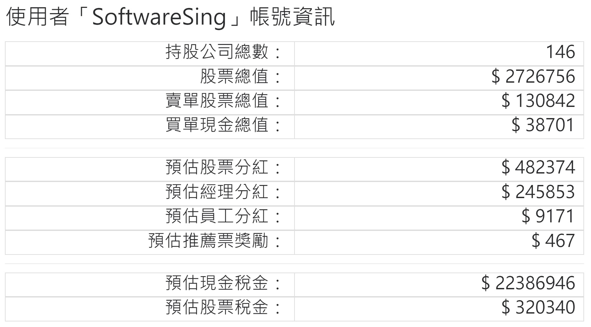
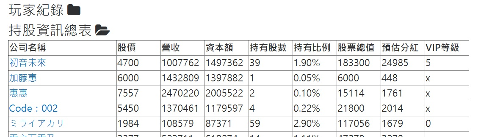

# ACGN-stock營利統計外掛 / SoftwareScript
A script helps you play [acgn-stock.com](https://acgn-stock.com).

一個幫助你在 [acgn-stock.com](https://acgn-stock.com) 獲得更豐富訊息的外掛

~~純粹因為中文太長，所以英文重新取名而不是照翻~~

## Install 安裝
安裝方法請參考PTT教學文 [安裝外掛教學](https://www.ptt.cc/bbs/ACGN_stock/M.1516605924.A.516.html)

[GreasyFork發布頁](https://greasyfork.org/zh-TW/scripts/33542)

### ( 安裝前請注意，本外掛中包含置底廣告訊息！ )

## 想寫更多功能?
你可以將這個project fork回去寫更多功能

* 在 [src](/src) 資料夾裡撰寫code
* 記得讓 main.js 或 其他檔案 有import你新增的檔案
* 以 python3 執行 [MergeFile.py](/MergeFile.py)，一個合併好的檔案就會輸出到 [ACGNs-SoftwareScript.user.js](/ACGNs-SoftwareScript.user.js)

## 目前的功能
### 更豐富的卡面訊息
* 持有總值
* 營收
* 帳面本益比 (未計算VIP加權股份時的本益比)
* 排他本益比 (計算VIP加權股份後 真實的本益比)
* 我的本益比 (依照使用者的VIP等級加權股份後得出的本益比)
* 預估分紅 (已依照使用者的VIP等級加權)
* 預估經理分紅 (僅該公司經理顯示此欄位)

### 帳號的更詳細資訊
在翻閱過帳號的持有股份、經理資訊、VIP資訊後，可以在頁面上得到詳細的統計資訊

(登入中的使用者在進入過 股市總覽 後便可得到詳細的持股資訊)
* 持有公司總數
* 股票總值 (未計算賣單中的股票)
* 賣單股票總值 (僅當前登入中的帳號可查看)
* 買單現金總值 (僅當前登入中的帳號可查看)
* 預估股票分紅 (已計算VIP加權股份)
* 預估經理分紅
* 預估員工分紅 (員工獎金 目前最高5%)
* 預估推薦票獎勵 (包含系統獎金 與 員工1%獎勵)
* 預估現金稅金 (以上方預估獲益、買單、現金來預估下季現金稅)
* 預估股票稅金 (以上方股票總值、賣單總值來預估下季股票稅)

### 持股資訊總表
在翻閱過帳號的相關訊息後，可以在底下查閱該帳號的持股總表 

(欲更新資訊請重新打開該資料夾)
* 股價
* 營收
* 資本額
* 持有股數 (賣單中的股份一併列出，以下同)
* 持有比例
* 股票總值
* 預估分紅 (已計算VIP加權股份)
* VIP等級

### 一次查看更大量的紀錄
在公司或帳號底下的 所以紀錄 翻閱過後，可以點選 大量紀錄 來一次顯示所有剛剛翻閱到的紀錄

(頁面重新整理後紀錄不會留存)

### 持有比例最多的公司
在進入 股市總覽 過後，在外掛選單中點選 [列出最多持股公司] 依照持股比例由高到低列出所持股的公司 

(重新整理列表請再點一次)

### 斷線提醒
在訪問特定資料達數次後，會在被伺服器斷線前提醒

### 資料搜尋
透過指定的條件來搜尋存在外掛中股市資料

(功能要求有外掛VIP資格才可使用)

### 廣告
置底廣告

